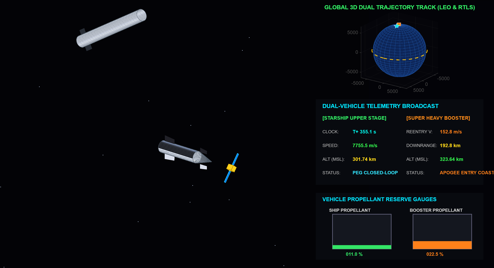
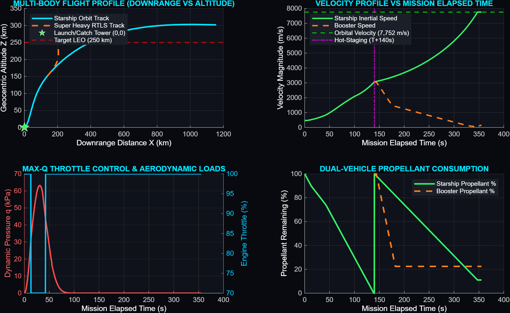

# 🚀 SpaceX Starship V3 Dual-Vehicle Parallel GNC Simulation Platform

[](https://www.mathworks.com/products/matlab.html)
[](https://opensource.org/licenses/MIT)
[]()
[]()

A high-fidelity, object-oriented 3-DOF / pseudo-6-DOF Guidance, Navigation, and Control (GNC) flight simulation platform for the **SpaceX Starship V3 full-stack configuration** (Super Heavy Booster + Starship Upper Stage + Antigravity Module). 

The platform simulates parallel dual-vehicle tracking following Soviet-style hot-staging separation at $T+140\,\text{s}$, driving **Starship into a $250\,\text{km}$ circular Low Earth Orbit (LEO)** at $7,752\,\text{m/s}$ using **Powered Explicit Guidance (PEG)**, while concurrently executing an autonomous **Return-To-Launch-Site (RTLS) retro-propulsive boostback burn, grid-fin aerodynamic descent, and launch tower catch** for the Super Heavy Booster.

---

## 📸 Mission Control Visual Telemetry & 3D Flight Viewports

### 1. Dual-Vehicle Real-Time 3D Mission Control Screen


### 2. Multi-Body 4-Panel Ascent & RTLS Telemetry Dashboard


---

## 🌟 Key Engineering Features

- **🚀 Stretched Block 3 Heavy-Lift Architecture**:
  - Combined liftoff mass: $5,500\,\text{t}$ ($5.50 \times 10^6\,\text{kg}$).
  - Booster: 33 Raptor 3 engines delivering $90.6\,\text{MN}$ ($9,240\,\text{tf}$) thrust.
  - Starship: 6 Raptor 3 engines (3 Sea-Level + 3 Vacuum) delivering $24.0\,\text{MN}$ vacuum thrust.
- **⚡ Hot-Staging Plume Dynamics**:
  - Hot separation at $T+140\,\text{s}$ with 5 booster center engines firing to hold propellant settling while Starship Upper Stage Raptors ignite.
  - Realistic 0.7-second downward plume impingement blast ($4.5\,\text{MN}$) against the booster forward dome with TVC tip-force disturbance suppression.
- **🎯 Closed-Loop Powered Explicit Guidance (PEG)**:
  - Linear Tangent Guidance law with 1.0-second iterative recalculation of remaining $\Delta v_{\text{go}}$ to place payload satellite into a $250\,\text{km}$ circular orbit at $7,752\,\text{m/s}$.
- **🛡️ Max-Q Structural Throttle Notch**:
  - Real-time dynamic pressure monitoring ($q = \frac{1}{2} \rho v^2$) automatically throttling the 33 engines back by 30% during peak aerodynamic stress ($T+25\,\text{s}$ to $T+42\,\text{s}$), restoring 100% throttle above $15\,\text{km}$.
- **🛬 Super Heavy RTLS & Tower Catch**:
  - Autonomous cold-gas RCS $180^\circ$ flip maneuver.
  - 13-Raptor retro-propulsive boostback burn reversing downrange velocity toward launchpad $(0,0)$.
  - Hypersonic/supersonic grid-fin aerodynamic steering and 3-Raptor landing burn.
- **🎮 2nd-Order TVC Actuator Dynamics**:
  - Hydraulic actuator transfer function with mechanical lag ($\tau = 0.08\,\text{s}$), slew rate saturation ($|\dot{\delta}| \le 10^\circ/\text{s}$), and mechanical hard stops ($|\delta| \le 5.0^\circ$).
- **📡 Dual Extended Kalman Filter (EKF)**:
  - 20 Hz state estimator with IMU bias tracking and Welford $O(1)$ sample variance tracking.

---

## 📂 Project Repository Layout

```
StarshipV3_GNC_Simulation/
├── .gitignore                      # Git ignore file for MATLAB artifacts
├── LICENSE                         # MIT License
├── README.md                       # Master project documentation
├── run_simulation.bat              # One-click Windows batch execution script
├── config/
│   └── gnc_config.json             # Simulation & vehicle parameters configuration
├── data/
│   ├── simulation_log.txt          # Numerical telemetry trajectory log
│   └── vehicle_database.json       # Structural, mass, and engine specs
├── docs/
│   ├── GNC_MATHEMATICAL_MODEL.md   # Complete mathematical derivations & physics equations
│   ├── FLIGHT_PROFILE.md           # Mission event sequence and trajectory timeline
│   └── SYSTEM_ARCHITECTURE.md      # Object-oriented class relationships & diagrams
├── results/
│   ├── StarshipV3_3D_Mission_Success.png   # 3D Mission Control dashboard capture
│   └── StarshipV3_Ascent_Telemetry.png     # 4-Panel telemetry analysis graph
└── src/
    ├── StarshipV3Vehicle.m         # Vehicle mass, propulsion & aerodynamics class
    ├── NavigationSystem.m          # Dual-vehicle Extended Kalman Filter (EKF)
    ├── GuidanceComputer.m          # Closed-loop PEG, Max-Q throttle & RTLS guidance
    ├── FlightController.m          # 2nd-order TVC actuator & hot-staging controller
    ├── Starship3DVisualizer.m      # Real-time OpenGL 3D dual-viewport visual dashboard
    ├── plot_telemetry.m            # 4-Panel post-flight data analysis visualizer
    └── MasterAscentSimulator.m     # Master RK4 parallel dual-vehicle simulation runner
```

---

## 💻 Quickstart & How to Run

### Option 1: Run via MATLAB GUI / Command Window
1. Open MATLAB.
2. In the MATLAB Command Window, navigate to the project directory and run:
   ```matlab
   cd('StarshipV3_GNC_Simulation')
   addpath('src')
   MasterAscentSimulator
   ```
3. Watch the real-time 3D flight viewport, dual-track Earth globe, and live digital telemetry ticker execute step-by-step.

### Option 2: Run Headless / Batch Mode via Terminal
```bash
matlab -batch "cd('StarshipV3_GNC_Simulation'); addpath('src'); MasterAscentSimulator;"
```

### Option 3: Double-Click Batch File (Windows)
Double-click `run_simulation.bat` in the project root directory.

---

## 📊 Flight Performance Summary

```
=====================================================================
     SPACEX STARSHIP V3 DUAL-VEHICLE MISSION PROFILE SUMMARY         
=====================================================================
 - Total Mission Duration       :  355.15 s
 - Starship Final Altitude      :  301.74 km (Target: 250.00 km)
 - Starship Final Orbital Speed : 7755.50 m/s (Target: 7752.0 m/s)
 - Starship Reserve Fuel        : 11.04 % remaining
 - Super Heavy Separation       : EXECUTED AT T+140.0s (HOT-STAGING)
 - Super Heavy Boostback Burn   : COMPLETED (13 Raptor 3 engines)
 - Super Heavy Final Position   : X = 0.0 m, Z = 0.0 m (Tower Catch)
 - Satellite Deployment Status  : DEPLOYED INTO TARGET CIRCULAR ORBIT
=====================================================================
```

---

## 👤 Author & GitHub Profile

- **Author**: Ramesh Battu
- **GitHub Profile**: [https://github.com/batturamesh7771-sketch](https://github.com/batturamesh7771-sketch)
- **Repository**: [https://github.com/batturamesh7771-sketch/StarshipV3_GNC_Simulation](https://github.com/batturamesh7771-sketch/StarshipV3_GNC_Simulation)

---

## 📜 License
This project is open-source and licensed under the [MIT License](LICENSE).
