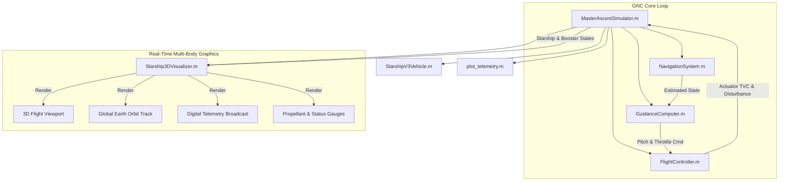

# SpaceX Starship V3 GNC Software Architecture

This document describes the modular object-oriented software design, execution pipeline, and class interactions of the platform.

## Class Responsibilities

1. `StarshipV3Vehicle.m`: Vehicle kinematics, 33 Raptor 3 & 6 Upper Stage propulsion envelopes, US Standard Atmosphere (1976), Mach-dependent drag curves, and grid-fin aerodynamics.
2. `NavigationSystem.m`: 20 Hz dual Extended Kalman Filter (EKF) with bias estimation and Welford running variance computation.
3. `GuidanceComputer.m`: Autonomous ascent gravity turn, Max-Q dynamic pressure throttle modulation, 1.0s iterative Powered Explicit Guidance (PEG), and Booster RTLS boostback/landing trajectories.
4. `FlightController.m`: 2nd-order hydraulic actuator lag (tau = 0.08s), slew rate limiter (10 deg/s), +/- 5.0 deg mechanical hard stops, and hot-staging plume impingement rejection.
5. `Starship3DVisualizer.m`: Real-time dual-viewport OpenGL graphical dashboard rendering 3D rocket geometries, booster separation, satellite deployment, 3D Earth globe, and live digital telemetry.
6. `MasterAscentSimulator.m`: Fixed-step RK4 numerical integration executive running the dual-vehicle simulation.
7. `plot_telemetry.m`: Publication-ready 4-panel post-flight analysis visualizer.
